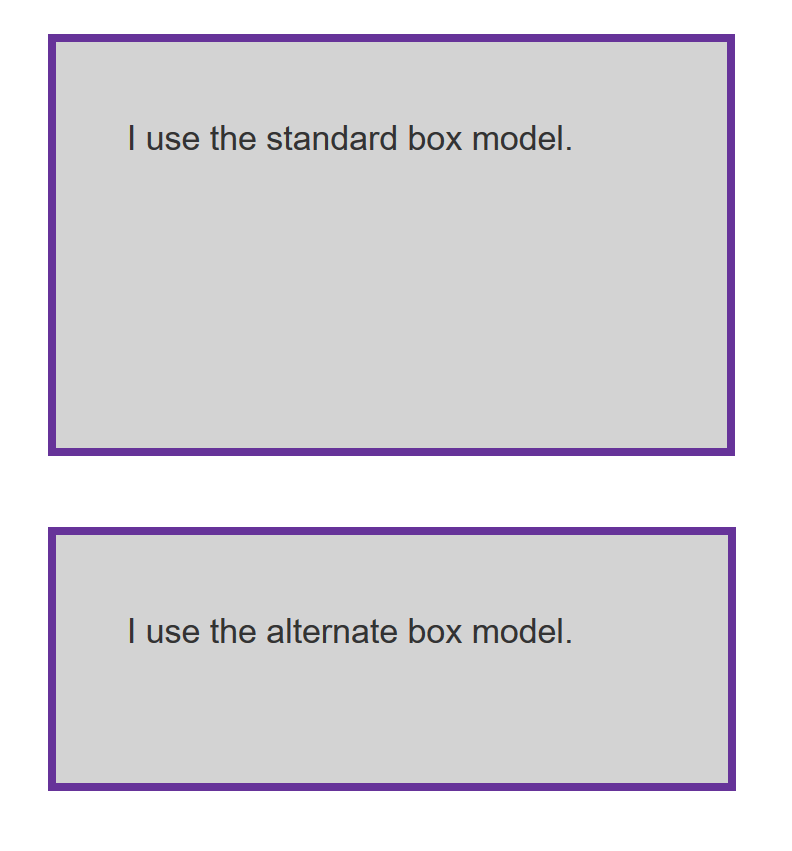

# The Box Model

Everything on the web is a box. The square shaped things are boxes, the round things are boxes. Every element on every web page is a box. This is the foundation of the "box model" when it comes to learning how to style things in CSS.

## Box Model Layers

Each element on a web page is broken into layers which are then rendered on the screen:

- Content: the actual content of the element. This can be text, an image, or any wrapper.
- Padding: whitespace _inside_ the border box. This adds whitespace _inside_ the container.
- Border: The width of any border styling.
- Margin: Any whitespace _outside_ the border box. This is generally used to space _between_ elements.


Understanding the box model will help you with everything from page layout to positioning items within a container.

## `inline` vs `block` display

Depending on the `display` property, boxes will act differently. CSS rules will also apply differently depending on the display type specified.

### `display: inline`

```css
span {
    display: inline;
}
```

For items with `display: inline`, the following will be true:

- The box will not break onto a new line.
- The width and height properties will not apply.
- Top and bottom padding, margins, and borders will apply but _will not cause other inline boxes to move away from the box_.
- Left and right padding, margins, and borders will apply and will cause other inline boxes to move away from the box.

Some HTML elements, such as `<a>`, `<span>`, `<em>` and `<strong>` use inline as their outer display type by default. Notice that default `inline` elements are always _within_ some other kind of element.

### `display: block`

```css
div {
    display: block;
}
```

If a box has an outer display type of block, then:

- The box will break onto a new line.
- The width and height properties are respected.
- Padding, margin and border will cause other elements to be pushed away from the box.
- If width is not specified, the box will extend in the inline direction to fill the space available in its container. In most cases, the box will become as wide as its container, filling up 100% of the space available.

Some HTML elements, such as `<h1>`, `<p>`, and all of the container elements, use block as their outer display type by default. Contrary to inline, these are the kinds of elements you would expect to be their own blocks on the page.

You can override _any_ outer display style in your CSS. Meaning, you can have an `anchor` element which breaks into its own line and takes up as much vertical and horizontal space as you'd like. It's not best practice, but you _can_ do it.

### `display:inline-block`

```css
span {
    display: inline-block;
}
```

Sometimes, you need an element to have some width added for emphasis but you do _not_ want it to break into it's own line. For these, the `inline-block` display is handy. It will respect it's position but also allow you to set `height` and `width` declarations. `padding`, `margin`, and `border` values will push other elements _away_ from the element. A common use for this is to style navigation links inside of a `ul` element. The buttons will become easier for a user to click or tap.

## Sizing

If we can resize all of these elements, how do we note which sizes to use? There are two methods you'll start with: `px` and `em`.

### `px` - pixels

These are _absolute units_ of measurement and will not change when the browser resizes. You can set pixels to any integer value. These work well if you're trying to position something at an exact distance that should not change regardless of browser window size. You generally do not size containers with pixels because they will not change if the user zooms or changes the browser window.

### `em` - emphasis

The `em` unit is a _relative unit_ which is based on the `font-size` property of a parent. This will change appropraitely if the parent's `font-size` declaration is changed either in the code or in the browser zoom settings.

## Assignment

Use the attached html file to complete the following tasks:

### Task 1

Style the navigation using the appropriate box display to put the elements in a row together. Make them larger so they're easier to click. Pretend bonus points if you add a border to the links to distinguish them from one another.

- Add margins around each nav link to separate them.
- Add padding to the nav link so it is larger.
- Add a blue background to the `nav` element
- Add a border to the nav items so they're easy to distinguish.

Your final product should look something like the image below:


### Task 2

The standard box model defaults to `content-box`. Make the first section look like the image below by using CSS to style both a `content-box` display element as well as a `border-box` display element.



### Task 3

An element has been templated for you. In this task, add to the box:

- A 5px, black, dotted border.
- A top margin of 20px.
- A right margin of 1em.
- A bottom margin of 40px.
- A left margin of 2em.
- Padding on all sides of 1em.

Your final result should look like the image below:


### Task 4

In this task, the inline element has a margin, padding and border. However, the lines above and below are overlapping it. What can you add to your CSS to cause the size of the margin, padding, and border to be respected by the other lines, while still keeping the element inline?

Your final result should look like the image below:

